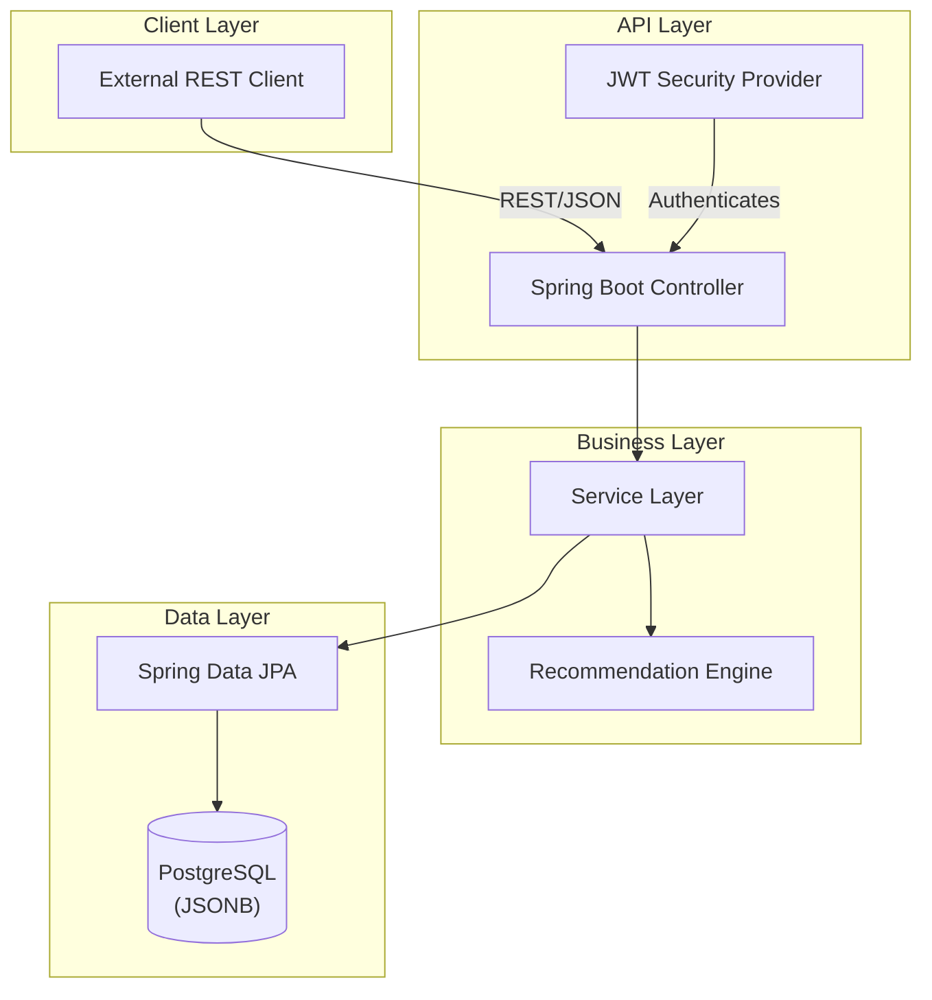

# 🏃‍♂️ Fitness Tracker API
A modern, high-performance REST API for tracking fitness activities and providing personalized recommendations. Built with **Java 21**, **Spring Boot 3.4**, and **PostgreSQL**.

## 🌐 Live Links
- **🚀 Deployed URL**: [https://fitness-zpc6.onrender.com](https://fitness-zpc6.onrender.com)
- **📖 Swagger Documentation**: [https://fitness-zpc6.onrender.com/swagger-ui/index.html#/](https://fitness-zpc6.onrender.com/swagger-ui/index.html#/)
- **🐳 DockerHub Image**: [adityasaini0070/fitness](https://hub.docker.com/r/adityasaini0070/fitness)

Java Spring Boot PostgreSQL License

📋 Table of Contents
- [Features](#-features)
- [Architecture](#-architecture)
- [Technology Stack](#-technology-stack)
- [Environment Variables](#-environment-variables)
- [Production-Readiness](#-production-readiness)
- [Testing](#-testing)
- [Future Roadmap](#-future-roadmap)
- [GitHub Topics](#-github-topics)

## ✨ Features
### Core Functionality
-   🏃‍♂️ **Activity Tracking** - Log diverse fitness activities (Running, Weight Training, Yoga, etc.) with support for dynamic metrics.
-   � **Automated Recommendations** - Extensible engine that analyzes user activities to provide actionable fitness advice and safety tips.
-   � **Secure Authentication** - Integrated Spring Security with JWT (HS256, UUID-based subject) for robust stateless authentication.
-   �️ **Clean Architecture** - Built using the Service-Repository pattern with standardized DTOs and custom Exception Handlers.
-   📊 **Performance Optimized** - Low-latency responses (10ms-50ms) with support for ~200 concurrent threads.

### Security Features
-   **Triple-Layer Security**: Authentication → Authorization → Verification
-   **JWT Refinement**: Moved from username-based to UUID-based subjects to prevent identity overlap.
-   **XSS & Injection Protection**: Built-in Spring Security tokens and JPA parameterized queries.
-   **Rate Limiting Ready**: Middleware structure prepared for future rate limiting implementation.

### Data Flexibility
-   **PostgreSQL JSONB** - Store `additional_metrics` (heart rate, GPS, sets/reps) without rigid schema migrations.
-   **UUID Identification** - Primary keys utilize UUIDs for enhanced security and distributed system compatibility.

## 🏗️ Architecture
### High-Level Architecture


### Logical Data Layer
The system leverages PostgreSQL's document-store capabilities:

| Activity Entity | | JSONB Metrics |
| :--- | :---: | :--- |
| `id (UUID)` | | `heart_rate` |
| `type (Enum)` | 🔗 FLEXIBLE | `distance_km` |
| `duration_min` | | `gps_coordinates` |
| `timestamp` | | `sets_reps` |

*Result: A single table can store data for hundreds of different activity types without schema changes.*

## 🛠️ Technology Stack
### Backend
-   **Framework**: Spring Boot 3.4.2
-   **Language**: Java 21
-   **Security**: Spring Security 6 (JWT HS256)
-   **ORM**: Hibernate / Spring Data JPA
-   **Database**: PostgreSQL 15+ (JSONB)
-   **Build Tool**: Maven

### Security
-   **Token Standard**: JWT (JSON Web Token)
-   **Hash Algorithm**: HS256
-   **Subject**: UUID-based
-   **Validation**: Spring Boot Starter Validation

### Utilities
-   **Boilerplate Reduction**: Lombok
-   **Logging**: SLF4J / Logback
-   **Containerization**: Docker Ready

## 🚀 Getting Started
### Prerequisites
-   JDK 21 or higher
-   PostgreSQL 15+
-   Maven 3.6+

### Installation
1. Clone the repository
   ```bash
   git clone https://github.com/adityasaini0070/fitness.git
   cd fitness
   ```
2. Configure Database
   - Create a database named `fitness`.
   - Update `src/main/resources/application.properties` with your credentials:
   ```properties
   spring.datasource.url=jdbc:postgresql://localhost:5432/fitness
   spring.datasource.username=YOUR_USERNAME
   spring.datasource.password=YOUR_PASSWORD
   ```
3. Build and Run
   ```bash
   ./mvnw clean install
   ./mvnw spring-boot:run
   ```
4. Access the application at `http://localhost:8082`

## 🐳 Docker Deployment
### 1. Build the Image
```bash
docker build -t fitness .
```

### 2. Run the Container
The application requires database environment variables. You can pass them using the `-e` flag:

```bash
docker run -p 8082:8082 \
  -e DB_URL=jdbc:postgresql://host.docker.internal:5432/fitness \
  -e DB_USER=your_username \
  -e DB_PWD=your_password \
  fitness
```

> Use `host.docker.internal` as the DB host to connect to a PostgreSQL instance running on your host machine (Windows/Mac).

## 🔑 Environment Variables
| Variable | Description |
| :--- | :--- |
| `DB_URL` | PostgreSQL JDBC URL |
| `DB_USER` | DB username |
| `DB_PWD` | DB password |
| `JWT_SECRET` | Signing key |
| `SERVER_PORT` | App port |

### Using Environment File
Alternatively, create a `.env` file (see `.env.example`) and run:
```bash
docker run -p 8082:8082 --env-file .env fitness
```

## 🗄️ Database Schema
### Core Tables
-   **users** - User accounts with roles and UUID-based identification.
-   **activities** - Core activity ledger featuring the `JSONB` metrics column.
-   **recommendations** - Automated insights tied to activities or user history.

### Key Technical Specs
-   **User-Activity Integrity**: Each activity belongs to exactly one authenticated user, enforced via foreign keys and unique constraints.
-   **Audit Ready**: Timestamps and activity logs for comprehensive tracking.

## 🔐 Security Features
### OWASP Compliance
-   ✅ **Broken Access Control** → Role-based authorization
-   ✅ **Cryptographic Failures** → UUID-based JWT subjects & standard hashing
-   ✅ **Injection** → JPA parameterized queries
-   ✅ **Security Logging** → Global exception handling for predictable errors

### Persistence Security
-   Full compatibility with PostgreSQL's security model.
-   Standardized 404/400 error responses to prevent sensitive info leakage.

## 📡 API Endpoints
### Authentication
-   `POST /api/users/register` - Create a new user account.
-   `POST /api/users/login` - Authenticate and receive JWT.

### Activities
-   `POST /api/activities` - Log a new fitness activity.
-   `GET  /api/activities/user/{userId}` - Retrieve all activities for a user.

### Recommendations
-   `POST /api/recommendation/generate` - Trigger/save a recommendation for an activity.
-   `GET  /api/recommendation/user/{userId}` - Fetch all insights for a user.
-   `GET  /api/recommendation/activity/{activityId}` - Fetch tie-in recommendations.

## 🧪 Testing
Run the full test suite:
```bash
mvn test
```
-   **Unit Tests**: Core business logic validation.
-   **Integration Tests**: End-to-end user registration, authentication, activity logging, and recommendation flows.
-   **Security Tests**: Authentication and role-gate verification.

## 🏭 Production-Readiness
- ✅ **Global Exception Handler** (`@ControllerAdvice`) - Standardized error responses.
- ✅ **Request Validation** (`@Valid`) - Schema enforcement for all inputs.
- ✅ **Docker multi-stage builds** - Optimized image size.
- ✅ **Stateless JWT auth** - Scalable session management.
- ✅ **DB indexing** - Foreign keys & high-traffic columns.
- ✅ **JSONB GIN indexes** - Performant search on dynamic activity metrics.

## 🔮 Future Roadmap
### Phase 1: Advanced Analytics
-   Integrate ML models for personalized health insights.
-   Historical pattern analysis and predictive health metrics.

### Phase 2: Real-time Integration
-   WebSocket support for live fitness tracking.
-   Social features and community challenges.

### Phase 3: Robust Load Testing
-   Automated performance suites to validate 300 RPS limits.
-   Redis caching layer integration for high-frequency data.

### Phase 4: Mobile & Ecosystem
-   Enriched API for React Native/Flutter apps.
-   Wearable device (Apple Watch, Garmin) synchronization.

## 📊 Project Metrics
-   10ms - 50ms average latency for core services.
-   Supports ~200 concurrent threads.
-   Scalable to millions of records with horizontal DB scaling.
-   Standardized on HS256 for optimal security/performance balance.
-   **Note**: Metrics measured using JMeter load tests on Dockerized deployment with PostgreSQL running locally.

## 🤝 Contributing
1. Fork the repository
2. Create a feature branch (`git checkout -b feature/AmazingFeature`)
3. Commit your changes (`git commit -m 'Add AmazingFeature'`)
4. Push to the branch (`git push origin feature/AmazingFeature`)
5. Open a Pull Request

## 📄 License
MIT License — free to use, modify, and distribute with attribution.

## 👤 Author
**Aditya Saini**
- **GitHub**: [@adityasaini0070](https://github.com/adityasaini0070)
- **Email**: [adityasaini0070@gmail.com](mailto:adityasaini0070@gmail.com)

Built with ❤️ for a healthier world.

## 🏷️ GitHub Topics
`spring-boot`, `java`, `backend`, `rest-api`, `postgresql`, `docker`, `jwt`, `swagger`, `microservices`
